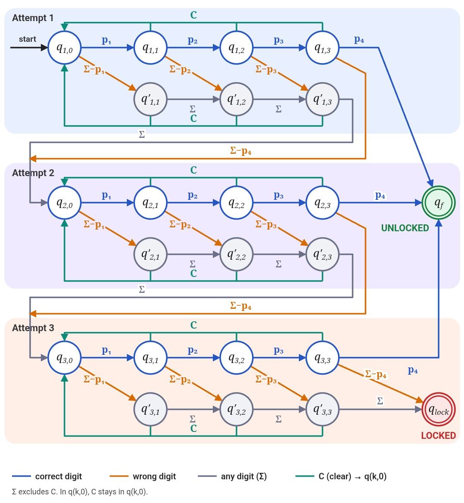
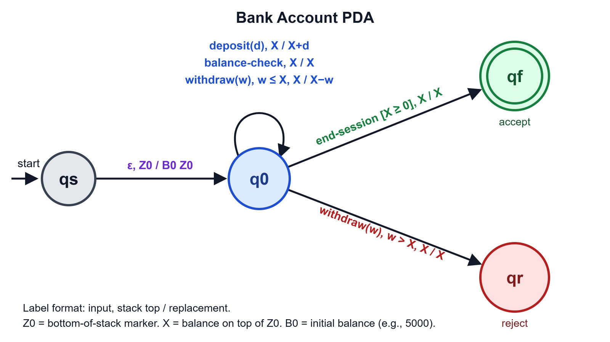
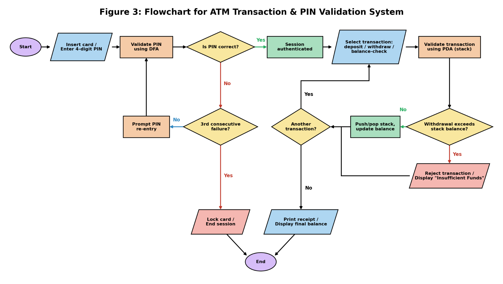

# ATM Transaction and PIN Validation System

TECH 315 (Models of Computation) team project, King's College.

## About the Project

This project uses automata theory to model an ATM. A DFA checks the PIN (3 attempts, then the card is locked). A PDA uses a stack to handle deposit, withdrawal and balance check.

## Team Members

- Ajay Karki
- Adeen Bajra Bajracharya
- Gagan Rai

## Models Used

| Model | Purpose |
|-------|---------|
| DFA | Validates the 4-digit PIN with 3 attempts and a lock state |
| PDA | Handles deposit, withdraw and balance check using a stack |

## Diagrams

### DFA (PIN Validation)

The DFA validates the user's 4-digit PIN and allows up to three attempts before the card is locked.

### PDA: Bank Account Transactions

The PDA uses a stack to represent the account balance and handles deposit, withdrawal, and balance-check operations. A withdrawal is rejected when the requested amount exceeds the available balance.

### System Flowchart

The flowchart shows the complete ATM process, from PIN entry and validation through transaction selection, PDA-based transaction validation, balance updates, and the final outcome.

